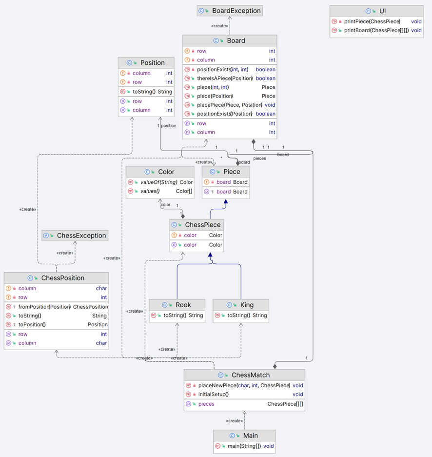

<h1> Chess Game for terminal </h1>
Projeto de um jogo de Xadrez em terminal

<h2> In this project the following skills will be trained: </h2>

* OOP Topics:
  * Encapsulation / Access Modifiers
  * Inheritance
  * Polymorphism (ToString)
  * Abstract method
  * Overloading
  * Constructors
  * Downcasting
  * Static members
  * Layers pattern
  * Exceptions
  * Enumerations

* Data Structures Topics:
    * Matrix
    * List

- Implementations
- [x] Starting to implement Board and Piece
- [x] Chess layer and printing the board
- [x] Placing pieces on the board
- [x] BoardException and defensive programming
- [x] ChessException and ChessPosition
- [x] Little improvement in board printing
- [ ] Moving pieces
- [ ] Handling exceptions and clearing screen
- [ ] Possible moves of a piece
- [ ] Implementing possible moves of Rook
- [ ] Printing possible moves
- [ ] Implementing possible moves of King
- [ ] Switching player each turn
- [ ] Handling captured pieces
- [ ] Check logic
- [ ] Checkmate logic
- [ ] Piece move count
- [ ] Pawn
- [ ] Bishop
- [ ] Knight
- [ ] Queen
- [ ] Special move - Castling
- [ ] Special move - En Passant
- [ ] Special move - Promotion

